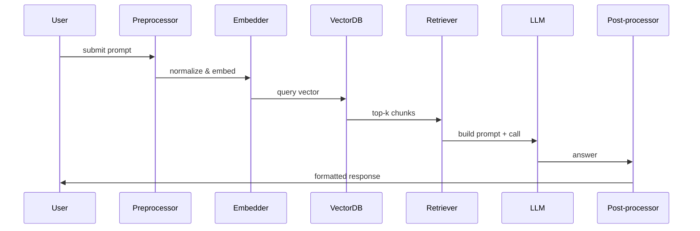

# Retrieval-Augmented Generation (RAG) Pipeline

User prompt → pre-processing → embed(prompt) → semantic retrieval from vector store → build augmented prompt (RAG context + prompt) → LLM call → post-process/format/return.

LangChain provides the building blocks (splitters, embedders, vectorstores, retrievers, chains); LangGraph is usually the graph/orchestration layer that wires nodes together and runs/observes the pipeline.

---

## Overview
This document explains, with examples and diagrams, how a typical RAG pipeline works end-to-end. It covers embeddings, retrieval, prompt assembly, the LLM call, and practical mappings to code and frameworks like LangChain and orchestration with LangGraph.

```mermaid
flowchart TD
  A[User prompt] --> B[Pre-processing]
  B --> C[Embed query]
  C --> D[Vector DB / Retriever]
  D --> E[Retrieve top-k chunks]
  E --> F[Build augmented prompt (inject context + question)]
  F --> G[LLM call]
  G --> H[Post-process / format / add citations]
  H --> I[Return answer]
```

---

## What “embeddings” are and where they are used
Embeddings are numeric vectors that encode semantic meaning of text (documents, chunks, sometimes queries) in a continuous space.

Typical uses in RAG:

- Document indexing: each document chunk is converted to an embedding and stored in a vector DB (FAISS, Chroma, Pinecone, etc.) along with metadata (source, doc-id, chunk-id).
- Query embedding: the incoming user prompt (or a normalized/expanded version of it) is embedded and used to perform a nearest-neighbor search in the vector DB.
- Optionally, embeddings are also used for reranking or clustering, or caching similar queries.

Important details:

- Use the same embedding model for documents and queries (or compatible models).
- Normalize vectors if using cosine similarity.
- Pick a similarity metric (cosine or inner product) and be consistent.

---

## How the user prompt is converted and used by RAG (step-by-step)

1. Step 0: Preprocessing
   - Normalize the prompt (lowercasing optional), remove irrelevant noise, maybe extract intents/entities or expand the query.

2. Step 1: Chunk documents (offline)
   - Large source documents are split into chunks (e.g., 500–1,500 tokens) with overlap (e.g., 50–200 tokens) to preserve context. Each chunk is embedded and stored with metadata (filename, url, line range).

3. Step 2: Embed the query
   - Create an embedding for the user prompt. This can be the raw prompt or a transformed query (e.g., add a short prefix like “Find relevant documentation for:” to guide retrieval).

4. Step 3: Retrieve candidate chunks
   - Run similarity search: `vector_store.search(query_vector, top_k)` → returns top-k chunks, each with a score and metadata.

5. Step 4: (Optional) Rerank or filter
   - Optionally rerank the candidates with a cross-encoder or apply heuristics (freshness, source trust, length) to improve precision.

6. Step 5: Build the augmented prompt (RAG “context injection”)
   - Use a prompt template that inserts retrieved chunks into the system/context area. Typical pattern:
     - System message: instructions/role + constraints (e.g., “only use the documents below”)
     - Context: “Document 1: …\nDocument 2: …” (trimmed to token budget)
     - User question: the original prompt (possibly with a short instruction for how to answer)
   - Include citations inline (e.g., `[source: fileX#L10-L20]`) so the LLM can attribute.

7. Step 6: LLM call
   - Send the constructed messages or single prompt to the LLM (OpenAI, Anthropic, or local LLM) with chosen model & parameters (temperature, max_tokens, streaming).

8. Step 7: Post-processing
   - Parse the LLM’s response, attach citations/footnotes using metadata, run safety checks, extract structured outputs if needed (JSON schema, extractor chain).

Constraint: ensure the total context (retrieved chunks + prompt) fits the model’s context window; if not, reduce chunk count, shorten chunks, or use summarization.

---

## Where embeddings appear in code (practical mapping)

- Document preparation code:
  - `TextLoader` / `DocumentLoader` → `TextSplitter` → `embed_documents()` → `vectorstore.add_documents()`

- Query path:
  - `embed_query()` → `vectorstore.similarity_search_by_vector()` → get top-k Document objects (text + metadata)

- RAG assembler:
  - `prompt_template.format(context=joined_docs, question=user_prompt)`

- LLM invocation:
  - `llm.generate(prompt)` or `llm.chat(messages)` — sometimes wrapped in a Chain/QA wrapper.

---

## Example pseudocode (framework-agnostic)

### Index time
```python
docs = load_documents(paths)
chunks = text_splitter.split_documents(docs)
vectors = embed_model.embed_documents([c.text for c in chunks])
vector_store.upsert(chunks, vectors, metadata=...)
```

### Query time
```python
q_vec = embed_model.embed_query(user_prompt)
results = vector_store.search(q_vec, top_k=5)
context = "\n\n".join([r.text for r in results])
final_prompt = prompt_template.replace("{context}", context).replace("{question}", user_prompt)
answer = LLM.generate(final_prompt)
```

---

## What LangChain does for you
LangChain is a library that provides the common building blocks that map directly to the steps above:

- Document loaders (PDF, HTML, S3, GitHub, etc.)
- TextSplitters (recursive, token-based) for chunking
- Embedding interfaces (OpenAI, Hugging Face, local models)
- VectorStore wrappers (FAISS, Chroma, Pinecone) with simple APIs
- Retriever objects that expose search and filtering
- Chains like `RetrievalQA`, `ConversationalRetrievalChain` that compose retrieval + LLM calls and common prompt templates
- `PromptTemplate` utilities and output parsers
- Memory abstractions (for chat history)

In code you’ll typically see:

```python
vectorstore = FAISS.from_documents(docs, embeddings)
retriever = vectorstore.as_retriever(search_kwargs={"k": 4})
chain = RetrievalQA.from_chain_type(llm=chat_model, retriever=retriever, chain_type="stuff")
result = chain.run(user_prompt)
```

LangChain also adds convenience features: streaming, callbacks, tracing, and standardized testing of chains.

---

## What LangGraph typically adds (how it differs)
LangGraph (in general terms) is a graph-based orchestration layer for LLM/data pipelines. Common responsibilities:

- Visual/graph representation of pipeline nodes (embedding, vector DB, LLM, post-processors)
- Declarative wiring of data flow between nodes (who calls whom, parallelism)
- Runtime orchestration: schedule node execution, manage inputs/outputs, handle retries/fallbacks
- Observability: visualize which nodes ran, latencies, errors, and pass metrics and payloads between nodes
- Reusability: reuse subgraphs, swap implementations (e.g., swap FAISS → Pinecone node without changing graph logic)

In practice you might use LangChain to write the logic and LangGraph to visually assemble, run, and monitor the pipeline, or to auto-generate and run workflows that call LangChain components.



---

## How the actual LLM call is constructed (message composition details)
Conversation-style LLMs use messages:

- `system`: role + global instruction (e.g., “You are a concise assistant, use only the documents given.”)
- `assistant/context`: sometimes include a short index or summary
- `user`: question + expected format

Prompt-template best practices:

- Keep system message short but strict (e.g., “Cite sources when possible.”)
- Prefix retrieved docs with source labels
- Limit retrieved text to what the model can reasonably attend to
- Include an instruction to “If you cannot answer from the provided documents say ‘I don’t know’.”

Parameters: temperature controls creativity; top_k/top_p, max_tokens, and stop sequences are used to control outputs. For grounded answers prefer lower temperature (0–0.3).

---

## Common variations / design choices
- "Stuff" vs "Map-Reduce" vs "Refine" chains:
  - `stuff`: put all retrieved text inline (cheap, simple, hits token limit quickly)
  - `map-reduce`: ask model to summarize each chunk then combine summaries (better for huge corpora)
  - `refine`: iterative refinement of an answer using chunks sequentially

- Query augmentation:
  - Convert question into a search query (e.g., extract keywords) before embedding for better retrieval

- Reranking:
  - Use a cross-encoder (LLM) to rerank top N retrieved docs for quality

- Citation & hallucination control:
  - Attach metadata and instruct model to only claim what’s present in context
  - Compare model answer to sources and highlight mismatches

---

## Pitfalls & Recommendations
- Token budget exhaustion: too many chunks cause truncation or expensive LLM calls — use summarization or smaller `k`.
- Embedding drift: using different embedding models for index vs query reduces retrieval quality.
- Over-reliance on a single top-k chunk can miss relevant information — experiment with `k` and reranking.
- Incomplete/misaligned prompt templates can cause hallucinations even with good retrieval.
- Metadata loss: store enough metadata with each chunk to produce useful citations.

---

## Next steps / Optional improvements
- Add concrete code examples from this repository and link the docs to the actual loader/splitter/embedder code.
- Implement reranking with a light-weight cross-encoder or an LLM-based scorer.
- Add a CI check that validates that the retrieval chain returns sources for sample queries (reduces regressions).

---

*Generated and formatted as a Markdown document with flow and sequence diagrams (Mermaid).*
